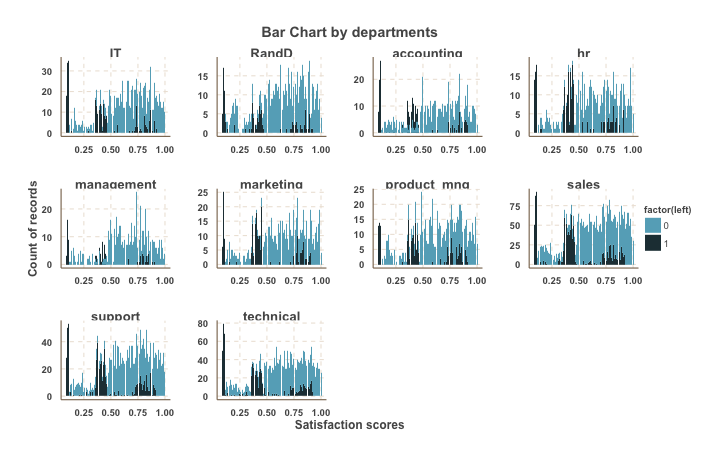
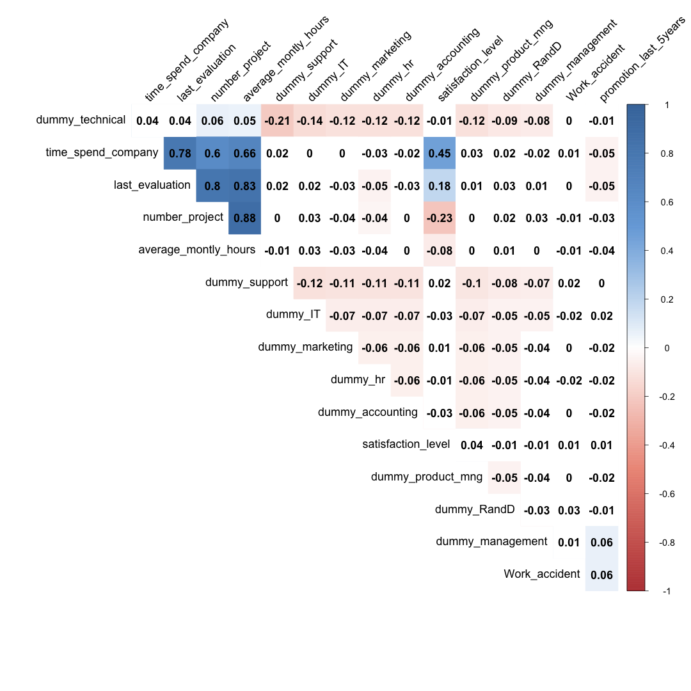

<hr>\clearpage

# The Business Question

What are the characteristics of employees that can help managers predict the possibility of a particular employee leaving the company?

The data is obtained from [Kaggle](https://www.kaggle.com/ludobenistant/hr-analytics).

<hr>\clearpage

# The Process

1. *Part 1*: We cleaned the data to change categorical variables to dummy variables.

2. *Part 2*: We did a factor analysis to identify factors that signal the possibility of an employee leaving.

3. *Part 3*: We did a cluster analysis to define the profile of employees who might leave the company.

Finally, we will use the results of this analysis to make business decisions to reduce the turnover of employees among those who are at the highest risk of leaving the company.


<hr>\clearpage

# The Data

First we loaded the data to use: `data/HR_comma_sep.csv`.


Then, we cleaned the data to create dummy variables for the Departments.



The light blue parts of the graph indicate people who stayed and the dark blue parts of the graph indicate people who left. We can note that in all departments, people who were extremely unhappy and had low satisfaction scores chose to leave the company. The number of people leaving declines with increasing satisfaction as can be expected. The department with the least turnover, is the management team, matching intuition that people who are typically recognized for their efforts through promotions are more satisfied. The accounting department closely follows this. The departments with the highest turnovers are arguably HR and support. Sales department has the highest percentage of retention of employees. Regardless of some patterns about employees leaving related to the departments they are in, we can note that satisfaction scores of employees vary in all departments leading to the turnover at certain critical points. Hence, there are other factors such as departments that can characterize employee turnover behavior and the rest of the analysis will help to identify them.

<hr>\clearpage

# Part 1: Key Customer Characteristics

From the data, we determine the key characteristics that identify the employees who left the firm. We are using the eigenvalue method to come up with the criterion to segment employees in multiple buckets.


```r
# Please ENTER then original raw attributes to use.  Please use numbers, not
# column names, e.g. c(1:5, 7, 8) uses columns 1,2,3,4,5,7,8
factor_attributes_used = c(1:6, 8, 11:20)

# Please ENTER the selection criterions for the factors to use.  Choices:
# 'eigenvalue', 'variance', 'manual'
factor_selectionciterion = "eigenvalue"

# Please ENTER the desired minumum variance explained (Only used in case
# 'variance' is the factor selection criterion used).
minimum_variance_explained = 65  # between 1 and 100

# Please ENTER the number of factors to use (Only used in case 'manual' is
# the factor selection criterion used).
manual_numb_factors_used = 5

# Please ENTER the rotation eventually used (e.g. 'none', 'varimax',
# 'quatimax', 'promax', 'oblimin', 'simplimax', and 'cluster' - see
# help(principal)). Default is 'varimax'
rotation_used = "varimax"
```


## Steps 1-2: Check the Data 

We check the data that it is all metric data:


```
## Error in loadNamespace(name): there is no package called 'webshot'
```

After running the eigenvalue method, we identified 16 parameters that define an employee in the data. These are satisfaction level, last evaluation completed, number of project, average monthly hours worked, time spend in the firm, work related accidents, number of promotions in last 5 years, and employee’s department (Accounting, HR, Technical, Support, Management, IT, Product Management, Marketing, and R&D).

Next, we depict the descriptive statistics of the 16 parameters with 0 being the mean.  


```
## Error in loadNamespace(name): there is no package called 'webshot'
```

## Step 3: Check Correlations

We check the correlation between the 16 characteristics (parameters) identified in Step 1 & 2. From the below figure, it is evident that few characteristics are very much correlated to one another. For example, characteristics time spend in the firm, last evaluation completed, number of project and average monthly hours are strongly correlated to one another. This is quite evident as these 4 characteristics when bunched together signify “involvement” of an employee in the firm which could be inferred as time spent in firm or working. Second example could be correlation between satisfaction level and time spent in the firm. A positive correlation implies that a person who had spent enough time in the firm is more satisfied than the employee who is new in the firm. One of the hidden meaning from this correlation is that an employee who has spent less time in the firm has more chances of leaving the firm than an employee who has spent more time than the first employee.

The correlation would be useful in performing the factor analysis on the data to better define an ex-employee. 



## Step 4: Choose number of factors

To further make the process easy to use and understandable, we would reduce the dimensions of the data i.e. reduce the variables (16 characteristics) identified in the previous step by performing the factor analysis. Factor analysis is a method to derive new and fewer components to better segment the data. 

The new factors will be the combination of 16 characteristics of the employees and will be 16 factors in total. First factor will explain most of the variance, second next and so on. Each factor will be associated with an eigenvalue. Eigenvalue corresponds to the amount of variance explained by each factor with standardized characteristics and each characteristic having a variance of 1. We will capture as much total variance as possible in as minimum factors as possible. 


```
## Error in loadNamespace(name): there is no package called 'webshot'
```


The blue plot shows the decreasing eigenvalues with maximum 10 factors corresponding to the maximum eigenvalue of 1. This means that 10 factors signify the maximum characteristics of the employees. 
One of the ways to determine the number of factors to move forward is the “elbow” like shape in the plot. This is where the eigenvalue is one.


```
## Error in loadNamespace(name): there is no package called 'webshot'
```


## Step 5: Interpret the factors


In this case we selected the varimax rotation. For our data, the 10 selected factors look as follows after this rotation: 


```
## Error: <text>:10:27: unexpected ','
## 9: #iprint.df(Rotated_Factors, scale=TRUE)
## 10: datatable((Rotated_Factors,
##                               ^
```

To better visualize and interpret the factors we suppress loadings with small values, e.g. with absolute values smaller than 0.5. In this case our factors look as follows after suppressing the small numbers:


```
## Error in eval(expr, envir, enclos): object 'Rotated_Factors' not found
```

```
## Error in Rotated_Factors_thres[abs(Rotated_Factors_thres) < MIN_VALUE] <- NA: object 'Rotated_Factors_thres' not found
```

```
## Error in is.data.frame(x): object 'Rotated_Factors' not found
```

```
## Error in rownames(Rotated_Factors): object 'Rotated_Factors' not found
```

```
## Error in iprint.df(Rotated_Factors_thres, scale = TRUE): object 'Rotated_Factors_thres' not found
```

After shortlisting the 10 factors based on the principal component analysis, we will try to define the factors based on the characteristics that are there in each factor. 

Component 1 (factor 1) consists of average monthly hours, last evaluation completed, number of projects completed and time spent in the firm. We will call this factor “Involvement” of an employee in the firm.

Component 2 (factor 2) consists of time spent in the firm and satisfaction level. We will call this factor “firm’s contribution to employee satisfaction”.

Component 3 (factor 3) consists of technical department and a support department (with negative weightage). We will call this factor “Technical department sans support function”.

Component 4 (factor 4) defines employee belonging to “IT department”.

Component 5 (factor 5) consists of Management department in the firm and number of promotions. This will signify “Promotions in Management”.

Component 6 (factor 6) defines employee not belonging to Human Resources and will call “Non-HR”.

Component 7 (factor 7) defines employee belonging to “Accounting”.

Component 8 (factor 8) defines employee belonging to “Marketing”.

Component 9 (factor 9) defines employee belonging to “Product Management”.

Component 10 (factor 10) defines employee belonging to “R&D”.


<hr>\clearpage

# Part 2: Customer Segmentation 

 

The segementation variables chosen are based on the highest weights observed in the 10 components from the factor analysis
1) last evaluation
2) average monthly hours
3) departments of accounting, hr, support, management, IT, product management, marketing and R&D


```r
# Please ENTER then original raw attributes to use for the segmentation (the
# 'segmentation attributes') Please use numbers, not column names, e.g.
# c(1:5, 7, 8) uses columns 1,2,3,4,5,7,8
segmentation_attributes_used = c(2, 4, 11, 12, 14, 15, 16, 17, 18, 19)

# Please ENTER then original raw attributes to use for the profiling of the
# segments (the 'profiling attributes') Please use numbers, not column
# names, e.g. c(1:5, 7, 8) uses columns 1,2,3,4,5,7,8
profile_attributes_used = c(2:19)

# Please ENTER the number of clusters to eventually use for this report
numb_clusters_used = 3  # for boats possibly use 5, for Mall_Visits use 3

# Please enter the method to use for the segmentation:
profile_with = "hclust"  #  'hclust' or 'kmeans'

# Please ENTER the distance metric eventually used for the clustering in
# case of hierarchical clustering (e.g. 'euclidean', 'maximum', 'manhattan',
# 'canberra', 'binary' or 'minkowski' - see help(dist)).  DEFAULT is
# 'euclidean'
distance_used = "euclidean"

# Please ENTER the hierarchical clustering method to use (options are:
# 'ward', 'single', 'complete', 'average', 'mcquitty', 'median' or
# 'centroid').  DEFAULT is 'ward'
hclust_method = "ward.D"

# Please ENTER the kmeans clustering method to use (options are:
# 'Hartigan-Wong', 'Lloyd', 'Forgy', 'MacQueen').  DEFAULT is 'Lloyd'
kmeans_method = "Lloyd"
```


## Step 3. Select Segmentation Variables

For simplicity will use one representative question for each of the factor we found in Part 1 (we can also use the "factor scores" for each respondent) to represent our survey respondents. These are the `segmentation_attributes_used` selected below. We can choose the question with the highest absolute factor loading for each factor. For example, when we use 5 factors with the varimax rotation we can select questions Q.1.9 (I see my boat as a status symbol), Q1.18 (Boating gives me a feeling of adventure), Q1.4 (I only consider buying a boat from a reputable brand), Q1.11 (I tend to perform minor boat repairs and maintenance on my own) and Q1.2 (When buying a boat  getting the lowest price is more important than the boat brand) - try it. These are columns 10, 19, 5, 12, and 3, respectively of the data matrix `Projectdata`. 
## Step 4: Define similarity measure

We need to define a distance metric that measures how different people (observations in general) are from each other. This can be an important choice. Here are the differences between the observations using the distance metric we selected:

<!--html_preserve--><div class="formattable_container"><table class="table table-condensed">
 <thead>
  <tr>
   <th style="text-align:left;">   </th>
   <th style="text-align:right;"> Obs.01 </th>
   <th style="text-align:right;"> Obs.02 </th>
   <th style="text-align:right;"> Obs.03 </th>
   <th style="text-align:right;"> Obs.04 </th>
   <th style="text-align:right;"> Obs.05 </th>
   <th style="text-align:right;"> Obs.06 </th>
   <th style="text-align:right;"> Obs.07 </th>
   <th style="text-align:right;"> Obs.08 </th>
   <th style="text-align:right;"> Obs.09 </th>
   <th style="text-align:right;"> Obs.10 </th>
  </tr>
 </thead>
<tbody>
  <tr>
   <td style="text-align:left;"> Obs.01 </td>
   <td style="text-align:right;"> <span style="display: inline-block; direction: rtl; border-radius: 4px; padding-right: 2px; background-color: #EEEEEE; width: 10.00%">0</span> </td>
   <td style="text-align:right;"> <span style="display: inline-block; direction: rtl; border-radius: 4px; padding-right: 2px; background-color: #EEEEEE"></span> </td>
   <td style="text-align:right;"> <span style="display: inline-block; direction: rtl; border-radius: 4px; padding-right: 2px; background-color: #EEEEEE"></span> </td>
   <td style="text-align:right;"> <span style="display: inline-block; direction: rtl; border-radius: 4px; padding-right: 2px; background-color: #EEEEEE"></span> </td>
   <td style="text-align:right;"> <span style="display: inline-block; direction: rtl; border-radius: 4px; padding-right: 2px; background-color: #EEEEEE"></span> </td>
   <td style="text-align:right;"> <span style="display: inline-block; direction: rtl; border-radius: 4px; padding-right: 2px; background-color: #EEEEEE"></span> </td>
   <td style="text-align:right;"> <span style="display: inline-block; direction: rtl; border-radius: 4px; padding-right: 2px; background-color: #EEEEEE"></span> </td>
   <td style="text-align:right;"> <span style="display: inline-block; direction: rtl; border-radius: 4px; padding-right: 2px; background-color: #EEEEEE"></span> </td>
   <td style="text-align:right;"> <span style="display: inline-block; direction: rtl; border-radius: 4px; padding-right: 2px; background-color: #EEEEEE"></span> </td>
   <td style="text-align:right;"> <span style="display: inline-block; direction: rtl; border-radius: 4px; padding-right: 2px; background-color: #EEEEEE"></span> </td>
  </tr>
  <tr>
   <td style="text-align:left;"> Obs.02 </td>
   <td style="text-align:right;"> <span style="display: inline-block; direction: rtl; border-radius: 4px; padding-right: 2px; background-color: #EEEEEE; width: 92.17%">105</span> </td>
   <td style="text-align:right;"> <span style="display: inline-block; direction: rtl; border-radius: 4px; padding-right: 2px; background-color: #EEEEEE; width: 10.00%">0</span> </td>
   <td style="text-align:right;"> <span style="display: inline-block; direction: rtl; border-radius: 4px; padding-right: 2px; background-color: #EEEEEE"></span> </td>
   <td style="text-align:right;"> <span style="display: inline-block; direction: rtl; border-radius: 4px; padding-right: 2px; background-color: #EEEEEE"></span> </td>
   <td style="text-align:right;"> <span style="display: inline-block; direction: rtl; border-radius: 4px; padding-right: 2px; background-color: #EEEEEE"></span> </td>
   <td style="text-align:right;"> <span style="display: inline-block; direction: rtl; border-radius: 4px; padding-right: 2px; background-color: #EEEEEE"></span> </td>
   <td style="text-align:right;"> <span style="display: inline-block; direction: rtl; border-radius: 4px; padding-right: 2px; background-color: #EEEEEE"></span> </td>
   <td style="text-align:right;"> <span style="display: inline-block; direction: rtl; border-radius: 4px; padding-right: 2px; background-color: #EEEEEE"></span> </td>
   <td style="text-align:right;"> <span style="display: inline-block; direction: rtl; border-radius: 4px; padding-right: 2px; background-color: #EEEEEE"></span> </td>
   <td style="text-align:right;"> <span style="display: inline-block; direction: rtl; border-radius: 4px; padding-right: 2px; background-color: #EEEEEE"></span> </td>
  </tr>
  <tr>
   <td style="text-align:left;"> Obs.03 </td>
   <td style="text-align:right;"> <span style="display: inline-block; direction: rtl; border-radius: 4px; padding-right: 2px; background-color: #EEEEEE; width: 100.00%">115</span> </td>
   <td style="text-align:right;"> <span style="display: inline-block; direction: rtl; border-radius: 4px; padding-right: 2px; background-color: #EEEEEE; width: 17.50%">10</span> </td>
   <td style="text-align:right;"> <span style="display: inline-block; direction: rtl; border-radius: 4px; padding-right: 2px; background-color: #EEEEEE; width: 10.00%">0</span> </td>
   <td style="text-align:right;"> <span style="display: inline-block; direction: rtl; border-radius: 4px; padding-right: 2px; background-color: #EEEEEE"></span> </td>
   <td style="text-align:right;"> <span style="display: inline-block; direction: rtl; border-radius: 4px; padding-right: 2px; background-color: #EEEEEE"></span> </td>
   <td style="text-align:right;"> <span style="display: inline-block; direction: rtl; border-radius: 4px; padding-right: 2px; background-color: #EEEEEE"></span> </td>
   <td style="text-align:right;"> <span style="display: inline-block; direction: rtl; border-radius: 4px; padding-right: 2px; background-color: #EEEEEE"></span> </td>
   <td style="text-align:right;"> <span style="display: inline-block; direction: rtl; border-radius: 4px; padding-right: 2px; background-color: #EEEEEE"></span> </td>
   <td style="text-align:right;"> <span style="display: inline-block; direction: rtl; border-radius: 4px; padding-right: 2px; background-color: #EEEEEE"></span> </td>
   <td style="text-align:right;"> <span style="display: inline-block; direction: rtl; border-radius: 4px; padding-right: 2px; background-color: #EEEEEE"></span> </td>
  </tr>
  <tr>
   <td style="text-align:left;"> Obs.04 </td>
   <td style="text-align:right;"> <span style="display: inline-block; direction: rtl; border-radius: 4px; padding-right: 2px; background-color: #EEEEEE; width: 61.65%">66</span> </td>
   <td style="text-align:right;"> <span style="display: inline-block; direction: rtl; border-radius: 4px; padding-right: 2px; background-color: #EEEEEE; width: 39.25%">39</span> </td>
   <td style="text-align:right;"> <span style="display: inline-block; direction: rtl; border-radius: 4px; padding-right: 2px; background-color: #EEEEEE; width: 43.92%">49</span> </td>
   <td style="text-align:right;"> <span style="display: inline-block; direction: rtl; border-radius: 4px; padding-right: 2px; background-color: #EEEEEE; width: 10.00%">0</span> </td>
   <td style="text-align:right;"> <span style="display: inline-block; direction: rtl; border-radius: 4px; padding-right: 2px; background-color: #EEEEEE"></span> </td>
   <td style="text-align:right;"> <span style="display: inline-block; direction: rtl; border-radius: 4px; padding-right: 2px; background-color: #EEEEEE"></span> </td>
   <td style="text-align:right;"> <span style="display: inline-block; direction: rtl; border-radius: 4px; padding-right: 2px; background-color: #EEEEEE"></span> </td>
   <td style="text-align:right;"> <span style="display: inline-block; direction: rtl; border-radius: 4px; padding-right: 2px; background-color: #EEEEEE"></span> </td>
   <td style="text-align:right;"> <span style="display: inline-block; direction: rtl; border-radius: 4px; padding-right: 2px; background-color: #EEEEEE"></span> </td>
   <td style="text-align:right;"> <span style="display: inline-block; direction: rtl; border-radius: 4px; padding-right: 2px; background-color: #EEEEEE"></span> </td>
  </tr>
  <tr>
   <td style="text-align:left;"> Obs.05 </td>
   <td style="text-align:right;"> <span style="display: inline-block; direction: rtl; border-radius: 4px; padding-right: 2px; background-color: #EEEEEE; width: 11.57%">2</span> </td>
   <td style="text-align:right;"> <span style="display: inline-block; direction: rtl; border-radius: 4px; padding-right: 2px; background-color: #EEEEEE; width: 87.25%">103</span> </td>
   <td style="text-align:right;"> <span style="display: inline-block; direction: rtl; border-radius: 4px; padding-right: 2px; background-color: #EEEEEE; width: 88.23%">113</span> </td>
   <td style="text-align:right;"> <span style="display: inline-block; direction: rtl; border-radius: 4px; padding-right: 2px; background-color: #EEEEEE; width: 81.11%">64</span> </td>
   <td style="text-align:right;"> <span style="display: inline-block; direction: rtl; border-radius: 4px; padding-right: 2px; background-color: #EEEEEE; width: 10.00%">0</span> </td>
   <td style="text-align:right;"> <span style="display: inline-block; direction: rtl; border-radius: 4px; padding-right: 2px; background-color: #EEEEEE"></span> </td>
   <td style="text-align:right;"> <span style="display: inline-block; direction: rtl; border-radius: 4px; padding-right: 2px; background-color: #EEEEEE"></span> </td>
   <td style="text-align:right;"> <span style="display: inline-block; direction: rtl; border-radius: 4px; padding-right: 2px; background-color: #EEEEEE"></span> </td>
   <td style="text-align:right;"> <span style="display: inline-block; direction: rtl; border-radius: 4px; padding-right: 2px; background-color: #EEEEEE"></span> </td>
   <td style="text-align:right;"> <span style="display: inline-block; direction: rtl; border-radius: 4px; padding-right: 2px; background-color: #EEEEEE"></span> </td>
  </tr>
  <tr>
   <td style="text-align:left;"> Obs.06 </td>
   <td style="text-align:right;"> <span style="display: inline-block; direction: rtl; border-radius: 4px; padding-right: 2px; background-color: #EEEEEE; width: 13.13%">4</span> </td>
   <td style="text-align:right;"> <span style="display: inline-block; direction: rtl; border-radius: 4px; padding-right: 2px; background-color: #EEEEEE; width: 91.75%">109</span> </td>
   <td style="text-align:right;"> <span style="display: inline-block; direction: rtl; border-radius: 4px; padding-right: 2px; background-color: #EEEEEE; width: 92.38%">119</span> </td>
   <td style="text-align:right;"> <span style="display: inline-block; direction: rtl; border-radius: 4px; padding-right: 2px; background-color: #EEEEEE; width: 87.78%">70</span> </td>
   <td style="text-align:right;"> <span style="display: inline-block; direction: rtl; border-radius: 4px; padding-right: 2px; background-color: #EEEEEE; width: 15.40%">6</span> </td>
   <td style="text-align:right;"> <span style="display: inline-block; direction: rtl; border-radius: 4px; padding-right: 2px; background-color: #EEEEEE; width: 10.00%">0</span> </td>
   <td style="text-align:right;"> <span style="display: inline-block; direction: rtl; border-radius: 4px; padding-right: 2px; background-color: #EEEEEE"></span> </td>
   <td style="text-align:right;"> <span style="display: inline-block; direction: rtl; border-radius: 4px; padding-right: 2px; background-color: #EEEEEE"></span> </td>
   <td style="text-align:right;"> <span style="display: inline-block; direction: rtl; border-radius: 4px; padding-right: 2px; background-color: #EEEEEE"></span> </td>
   <td style="text-align:right;"> <span style="display: inline-block; direction: rtl; border-radius: 4px; padding-right: 2px; background-color: #EEEEEE"></span> </td>
  </tr>
  <tr>
   <td style="text-align:left;"> Obs.07 </td>
   <td style="text-align:right;"> <span style="display: inline-block; direction: rtl; border-radius: 4px; padding-right: 2px; background-color: #EEEEEE; width: 80.43%">90</span> </td>
   <td style="text-align:right;"> <span style="display: inline-block; direction: rtl; border-radius: 4px; padding-right: 2px; background-color: #EEEEEE; width: 21.25%">15</span> </td>
   <td style="text-align:right;"> <span style="display: inline-block; direction: rtl; border-radius: 4px; padding-right: 2px; background-color: #EEEEEE; width: 27.31%">25</span> </td>
   <td style="text-align:right;"> <span style="display: inline-block; direction: rtl; border-radius: 4px; padding-right: 2px; background-color: #EEEEEE; width: 36.67%">24</span> </td>
   <td style="text-align:right;"> <span style="display: inline-block; direction: rtl; border-radius: 4px; padding-right: 2px; background-color: #EEEEEE; width: 89.20%">88</span> </td>
   <td style="text-align:right;"> <span style="display: inline-block; direction: rtl; border-radius: 4px; padding-right: 2px; background-color: #EEEEEE; width: 89.81%">94</span> </td>
   <td style="text-align:right;"> <span style="display: inline-block; direction: rtl; border-radius: 4px; padding-right: 2px; background-color: #EEEEEE; width: 10.00%">0</span> </td>
   <td style="text-align:right;"> <span style="display: inline-block; direction: rtl; border-radius: 4px; padding-right: 2px; background-color: #EEEEEE"></span> </td>
   <td style="text-align:right;"> <span style="display: inline-block; direction: rtl; border-radius: 4px; padding-right: 2px; background-color: #EEEEEE"></span> </td>
   <td style="text-align:right;"> <span style="display: inline-block; direction: rtl; border-radius: 4px; padding-right: 2px; background-color: #EEEEEE"></span> </td>
  </tr>
  <tr>
   <td style="text-align:left;"> Obs.08 </td>
   <td style="text-align:right;"> <span style="display: inline-block; direction: rtl; border-radius: 4px; padding-right: 2px; background-color: #EEEEEE; width: 89.83%">102</span> </td>
   <td style="text-align:right;"> <span style="display: inline-block; direction: rtl; border-radius: 4px; padding-right: 2px; background-color: #EEEEEE; width: 12.25%">3</span> </td>
   <td style="text-align:right;"> <span style="display: inline-block; direction: rtl; border-radius: 4px; padding-right: 2px; background-color: #EEEEEE; width: 19.00%">13</span> </td>
   <td style="text-align:right;"> <span style="display: inline-block; direction: rtl; border-radius: 4px; padding-right: 2px; background-color: #EEEEEE; width: 50.00%">36</span> </td>
   <td style="text-align:right;"> <span style="display: inline-block; direction: rtl; border-radius: 4px; padding-right: 2px; background-color: #EEEEEE; width: 100.00%">100</span> </td>
   <td style="text-align:right;"> <span style="display: inline-block; direction: rtl; border-radius: 4px; padding-right: 2px; background-color: #EEEEEE; width: 100.00%">106</span> </td>
   <td style="text-align:right;"> <span style="display: inline-block; direction: rtl; border-radius: 4px; padding-right: 2px; background-color: #EEEEEE; width: 20.29%">12</span> </td>
   <td style="text-align:right;"> <span style="display: inline-block; direction: rtl; border-radius: 4px; padding-right: 2px; background-color: #EEEEEE; width: 10.00%">0</span> </td>
   <td style="text-align:right;"> <span style="display: inline-block; direction: rtl; border-radius: 4px; padding-right: 2px; background-color: #EEEEEE"></span> </td>
   <td style="text-align:right;"> <span style="display: inline-block; direction: rtl; border-radius: 4px; padding-right: 2px; background-color: #EEEEEE"></span> </td>
  </tr>
  <tr>
   <td style="text-align:left;"> Obs.09 </td>
   <td style="text-align:right;"> <span style="display: inline-block; direction: rtl; border-radius: 4px; padding-right: 2px; background-color: #EEEEEE; width: 62.43%">67</span> </td>
   <td style="text-align:right;"> <span style="display: inline-block; direction: rtl; border-radius: 4px; padding-right: 2px; background-color: #EEEEEE; width: 38.50%">38</span> </td>
   <td style="text-align:right;"> <span style="display: inline-block; direction: rtl; border-radius: 4px; padding-right: 2px; background-color: #EEEEEE; width: 43.23%">48</span> </td>
   <td style="text-align:right;"> <span style="display: inline-block; direction: rtl; border-radius: 4px; padding-right: 2px; background-color: #EEEEEE; width: 11.11%">1</span> </td>
   <td style="text-align:right;"> <span style="display: inline-block; direction: rtl; border-radius: 4px; padding-right: 2px; background-color: #EEEEEE; width: 68.50%">65</span> </td>
   <td style="text-align:right;"> <span style="display: inline-block; direction: rtl; border-radius: 4px; padding-right: 2px; background-color: #EEEEEE; width: 70.28%">71</span> </td>
   <td style="text-align:right;"> <span style="display: inline-block; direction: rtl; border-radius: 4px; padding-right: 2px; background-color: #EEEEEE; width: 29.71%">23</span> </td>
   <td style="text-align:right;"> <span style="display: inline-block; direction: rtl; border-radius: 4px; padding-right: 2px; background-color: #EEEEEE; width: 36.92%">35</span> </td>
   <td style="text-align:right;"> <span style="display: inline-block; direction: rtl; border-radius: 4px; padding-right: 2px; background-color: #EEEEEE; width: 10.00%">0</span> </td>
   <td style="text-align:right;"> <span style="display: inline-block; direction: rtl; border-radius: 4px; padding-right: 2px; background-color: #EEEEEE"></span> </td>
  </tr>
  <tr>
   <td style="text-align:left;"> Obs.10 </td>
   <td style="text-align:right;"> <span style="display: inline-block; direction: rtl; border-radius: 4px; padding-right: 2px; background-color: #EEEEEE; width: 21.74%">15</span> </td>
   <td style="text-align:right;"> <span style="display: inline-block; direction: rtl; border-radius: 4px; padding-right: 2px; background-color: #EEEEEE; width: 100.00%">120</span> </td>
   <td style="text-align:right;"> <span style="display: inline-block; direction: rtl; border-radius: 4px; padding-right: 2px; background-color: #EEEEEE; width: 100.00%">130</span> </td>
   <td style="text-align:right;"> <span style="display: inline-block; direction: rtl; border-radius: 4px; padding-right: 2px; background-color: #EEEEEE; width: 100.00%">81</span> </td>
   <td style="text-align:right;"> <span style="display: inline-block; direction: rtl; border-radius: 4px; padding-right: 2px; background-color: #EEEEEE; width: 25.30%">17</span> </td>
   <td style="text-align:right;"> <span style="display: inline-block; direction: rtl; border-radius: 4px; padding-right: 2px; background-color: #EEEEEE; width: 19.34%">11</span> </td>
   <td style="text-align:right;"> <span style="display: inline-block; direction: rtl; border-radius: 4px; padding-right: 2px; background-color: #EEEEEE; width: 100.00%">105</span> </td>
   <td style="text-align:right;"> <span style="display: inline-block; direction: rtl; border-radius: 4px; padding-right: 2px; background-color: #EEEEEE; width: 100.00%">117</span> </td>
   <td style="text-align:right;"> <span style="display: inline-block; direction: rtl; border-radius: 4px; padding-right: 2px; background-color: #EEEEEE; width: 100.00%">82</span> </td>
   <td style="text-align:right;"> <span style="display: inline-block; direction: rtl; border-radius: 4px; padding-right: 2px; background-color: #EEEEEE; width: 0.00%">0</span> </td>
  </tr>
</tbody>
</table></div><!--/html_preserve-->

## Step 5: Visualize Pair-wise Distances

We can see the histogram of, say, the first 2 variables (can you change the code chunk in the raw .Rmd file to see other variables?)

<!--html_preserve--><div>
<div id="htmlwidget-e66d10ccef16054e54b1" style="width:100%;height:480px;" class="c3 html-widget"></div>
<script type="application/json" data-for="htmlwidget-e66d10ccef16054e54b1">{"x":{"data":{"x":"x","json":[{"x":0.4,"Frequency":726},{"x":0.5,"Frequency":889},{"x":0.6,"Frequency":55},{"x":0.7,"Frequency":210},{"x":0.8,"Frequency":817},{"x":0.9,"Frequency":874}],"keys":{"value":["x","Frequency"]},"xs":{"Frequency":"x"},"type":"bar"},"axis":{"x":{"show":true,"type":"indexed","label":"Variable 1"},"rotated":false},"bar":{"zerobased":true,"width":{"ratio":0.9}}},"evals":[],"jsHooks":[]}</script>
<div id="htmlwidget-88c709bf3d423ffdc41a" style="width:100%;height:480px;" class="c3 html-widget"></div>
<script type="application/json" data-for="htmlwidget-88c709bf3d423ffdc41a">{"x":{"data":{"x":"x","json":[{"x":100,"Frequency":1086},{"x":150,"Frequency":570},{"x":200,"Frequency":673},{"x":250,"Frequency":1083},{"x":300,"Frequency":159}],"keys":{"value":["x","Frequency"]},"xs":{"Frequency":"x"},"type":"bar"},"axis":{"x":{"show":true,"type":"indexed","label":"Variable 2"},"rotated":false},"bar":{"zerobased":true,"width":{"ratio":0.9}}},"evals":[],"jsHooks":[]}</script>
</div><!--/html_preserve-->

or the histogram of all pairwise distances for the euclidean distance:


```
## Error in loadNamespace(name): there is no package called 'webshot'
```

## Step 6: Method and Number of Segments

We need to select the clustering method to use, as well as the number of cluster. It may be useful to see the dendrogram from Hierarchical Clustering, to have a quick idea of how the data may be segmented and how many segments there may be. Here is the dendrogram for our data:


```
## Error in loadNamespace(name): there is no package called 'webshot'
```

We can also plot the "distances" traveled before we need to merge any of the lower and smaller in size clusters into larger ones - the heights of the tree branches that link the clusters as we traverse the tree from its leaves to its root. If we have n observations, this plot has n-1 numbers, we see the first 20 here. 

```
## Error in loadNamespace(name): there is no package called 'webshot'
```

Here is the segment membership of the first 10 respondents if we use hierarchical clustering:

<!--html_preserve--><div class="formattable_container"><table class="table table-condensed">
 <thead>
  <tr>
   <th style="text-align:right;"> Observation Number </th>
   <th style="text-align:right;"> Cluster_Membership </th>
  </tr>
 </thead>
<tbody>
  <tr>
   <td style="text-align:right;"> <span style="display: inline-block; direction: rtl; border-radius: 4px; padding-right: 2px; background-color: #EEEEEE; width: 10.00%">1</span> </td>
   <td style="text-align:right;"> <span style="display: inline-block; direction: rtl; border-radius: 4px; padding-right: 2px; background-color: #EEEEEE; width: 10.00%">1</span> </td>
  </tr>
  <tr>
   <td style="text-align:right;"> <span style="display: inline-block; direction: rtl; border-radius: 4px; padding-right: 2px; background-color: #EEEEEE; width: 20.00%">2</span> </td>
   <td style="text-align:right;"> <span style="display: inline-block; direction: rtl; border-radius: 4px; padding-right: 2px; background-color: #EEEEEE; width: 100.00%">2</span> </td>
  </tr>
  <tr>
   <td style="text-align:right;"> <span style="display: inline-block; direction: rtl; border-radius: 4px; padding-right: 2px; background-color: #EEEEEE; width: 30.00%">3</span> </td>
   <td style="text-align:right;"> <span style="display: inline-block; direction: rtl; border-radius: 4px; padding-right: 2px; background-color: #EEEEEE; width: 100.00%">2</span> </td>
  </tr>
  <tr>
   <td style="text-align:right;"> <span style="display: inline-block; direction: rtl; border-radius: 4px; padding-right: 2px; background-color: #EEEEEE; width: 40.00%">4</span> </td>
   <td style="text-align:right;"> <span style="display: inline-block; direction: rtl; border-radius: 4px; padding-right: 2px; background-color: #EEEEEE; width: 100.00%">2</span> </td>
  </tr>
  <tr>
   <td style="text-align:right;"> <span style="display: inline-block; direction: rtl; border-radius: 4px; padding-right: 2px; background-color: #EEEEEE; width: 50.00%">5</span> </td>
   <td style="text-align:right;"> <span style="display: inline-block; direction: rtl; border-radius: 4px; padding-right: 2px; background-color: #EEEEEE; width: 10.00%">1</span> </td>
  </tr>
  <tr>
   <td style="text-align:right;"> <span style="display: inline-block; direction: rtl; border-radius: 4px; padding-right: 2px; background-color: #EEEEEE; width: 60.00%">6</span> </td>
   <td style="text-align:right;"> <span style="display: inline-block; direction: rtl; border-radius: 4px; padding-right: 2px; background-color: #EEEEEE; width: 10.00%">1</span> </td>
  </tr>
  <tr>
   <td style="text-align:right;"> <span style="display: inline-block; direction: rtl; border-radius: 4px; padding-right: 2px; background-color: #EEEEEE; width: 70.00%">7</span> </td>
   <td style="text-align:right;"> <span style="display: inline-block; direction: rtl; border-radius: 4px; padding-right: 2px; background-color: #EEEEEE; width: 100.00%">2</span> </td>
  </tr>
  <tr>
   <td style="text-align:right;"> <span style="display: inline-block; direction: rtl; border-radius: 4px; padding-right: 2px; background-color: #EEEEEE; width: 80.00%">8</span> </td>
   <td style="text-align:right;"> <span style="display: inline-block; direction: rtl; border-radius: 4px; padding-right: 2px; background-color: #EEEEEE; width: 100.00%">2</span> </td>
  </tr>
  <tr>
   <td style="text-align:right;"> <span style="display: inline-block; direction: rtl; border-radius: 4px; padding-right: 2px; background-color: #EEEEEE; width: 90.00%">9</span> </td>
   <td style="text-align:right;"> <span style="display: inline-block; direction: rtl; border-radius: 4px; padding-right: 2px; background-color: #EEEEEE; width: 100.00%">2</span> </td>
  </tr>
  <tr>
   <td style="text-align:right;"> <span style="display: inline-block; direction: rtl; border-radius: 4px; padding-right: 2px; background-color: #EEEEEE; width: 100.00%">10</span> </td>
   <td style="text-align:right;"> <span style="display: inline-block; direction: rtl; border-radius: 4px; padding-right: 2px; background-color: #EEEEEE; width: 10.00%">1</span> </td>
  </tr>
</tbody>
</table></div><!--/html_preserve-->

while this is the segment membership if we use k-means:

<!--html_preserve--><div class="formattable_container"><table class="table table-condensed">
 <thead>
  <tr>
   <th style="text-align:right;"> Observation Number </th>
   <th style="text-align:right;"> Cluster_Membership </th>
  </tr>
 </thead>
<tbody>
  <tr>
   <td style="text-align:right;"> <span style="display: inline-block; direction: rtl; border-radius: 4px; padding-right: 2px; background-color: #EEEEEE; width: 10.00%">1</span> </td>
   <td style="text-align:right;"> <span style="display: inline-block; direction: rtl; border-radius: 4px; padding-right: 2px; background-color: #EEEEEE; width: 100.00%">3</span> </td>
  </tr>
  <tr>
   <td style="text-align:right;"> <span style="display: inline-block; direction: rtl; border-radius: 4px; padding-right: 2px; background-color: #EEEEEE; width: 20.00%">2</span> </td>
   <td style="text-align:right;"> <span style="display: inline-block; direction: rtl; border-radius: 4px; padding-right: 2px; background-color: #EEEEEE; width: 55.00%">2</span> </td>
  </tr>
  <tr>
   <td style="text-align:right;"> <span style="display: inline-block; direction: rtl; border-radius: 4px; padding-right: 2px; background-color: #EEEEEE; width: 30.00%">3</span> </td>
   <td style="text-align:right;"> <span style="display: inline-block; direction: rtl; border-radius: 4px; padding-right: 2px; background-color: #EEEEEE; width: 55.00%">2</span> </td>
  </tr>
  <tr>
   <td style="text-align:right;"> <span style="display: inline-block; direction: rtl; border-radius: 4px; padding-right: 2px; background-color: #EEEEEE; width: 40.00%">4</span> </td>
   <td style="text-align:right;"> <span style="display: inline-block; direction: rtl; border-radius: 4px; padding-right: 2px; background-color: #EEEEEE; width: 55.00%">2</span> </td>
  </tr>
  <tr>
   <td style="text-align:right;"> <span style="display: inline-block; direction: rtl; border-radius: 4px; padding-right: 2px; background-color: #EEEEEE; width: 50.00%">5</span> </td>
   <td style="text-align:right;"> <span style="display: inline-block; direction: rtl; border-radius: 4px; padding-right: 2px; background-color: #EEEEEE; width: 100.00%">3</span> </td>
  </tr>
  <tr>
   <td style="text-align:right;"> <span style="display: inline-block; direction: rtl; border-radius: 4px; padding-right: 2px; background-color: #EEEEEE; width: 60.00%">6</span> </td>
   <td style="text-align:right;"> <span style="display: inline-block; direction: rtl; border-radius: 4px; padding-right: 2px; background-color: #EEEEEE; width: 100.00%">3</span> </td>
  </tr>
  <tr>
   <td style="text-align:right;"> <span style="display: inline-block; direction: rtl; border-radius: 4px; padding-right: 2px; background-color: #EEEEEE; width: 70.00%">7</span> </td>
   <td style="text-align:right;"> <span style="display: inline-block; direction: rtl; border-radius: 4px; padding-right: 2px; background-color: #EEEEEE; width: 55.00%">2</span> </td>
  </tr>
  <tr>
   <td style="text-align:right;"> <span style="display: inline-block; direction: rtl; border-radius: 4px; padding-right: 2px; background-color: #EEEEEE; width: 80.00%">8</span> </td>
   <td style="text-align:right;"> <span style="display: inline-block; direction: rtl; border-radius: 4px; padding-right: 2px; background-color: #EEEEEE; width: 55.00%">2</span> </td>
  </tr>
  <tr>
   <td style="text-align:right;"> <span style="display: inline-block; direction: rtl; border-radius: 4px; padding-right: 2px; background-color: #EEEEEE; width: 90.00%">9</span> </td>
   <td style="text-align:right;"> <span style="display: inline-block; direction: rtl; border-radius: 4px; padding-right: 2px; background-color: #EEEEEE; width: 55.00%">2</span> </td>
  </tr>
  <tr>
   <td style="text-align:right;"> <span style="display: inline-block; direction: rtl; border-radius: 4px; padding-right: 2px; background-color: #EEEEEE; width: 100.00%">10</span> </td>
   <td style="text-align:right;"> <span style="display: inline-block; direction: rtl; border-radius: 4px; padding-right: 2px; background-color: #EEEEEE; width: 10.00%">1</span> </td>
  </tr>
</tbody>
</table></div><!--/html_preserve-->

## Step 7: Profile and interpret the segments 

The table below uses the 10 variables to segment employees by showing the average of all the input variables in each segment of employee compared to the ratio of the average of all the employees using the ratio of the two.

<!--html_preserve--><div class="formattable_container"><table class="table table-condensed">
 <thead>
  <tr>
   <th style="text-align:left;">   </th>
   <th style="text-align:right;"> Population </th>
   <th style="text-align:right;"> Seg.1 </th>
   <th style="text-align:right;"> Seg.2 </th>
   <th style="text-align:right;"> Seg.3 </th>
  </tr>
 </thead>
<tbody>
  <tr>
   <td style="text-align:left;"> last_evaluation </td>
   <td style="text-align:right;"> <span style="display: inline-block; direction: rtl; border-radius: 4px; padding-right: 2px; background-color: #EEEEEE; width: 10.31%">0.72</span> </td>
   <td style="text-align:right;"> <span style="display: inline-block; direction: rtl; border-radius: 4px; padding-right: 2px; background-color: #EEEEEE; width: 10.32%">0.53</span> </td>
   <td style="text-align:right;"> <span style="display: inline-block; direction: rtl; border-radius: 4px; padding-right: 2px; background-color: #EEEEEE; width: 10.32%">0.88</span> </td>
   <td style="text-align:right;"> <span style="display: inline-block; direction: rtl; border-radius: 4px; padding-right: 2px; background-color: #EEEEEE; width: 10.26%">0.85</span> </td>
  </tr>
  <tr>
   <td style="text-align:left;"> number_project </td>
   <td style="text-align:right;"> <span style="display: inline-block; direction: rtl; border-radius: 4px; padding-right: 2px; background-color: #EEEEEE; width: 11.67%">3.86</span> </td>
   <td style="text-align:right;"> <span style="display: inline-block; direction: rtl; border-radius: 4px; padding-right: 2px; background-color: #EEEEEE; width: 11.34%">2.15</span> </td>
   <td style="text-align:right;"> <span style="display: inline-block; direction: rtl; border-radius: 4px; padding-right: 2px; background-color: #EEEEEE; width: 11.81%">5.01</span> </td>
   <td style="text-align:right;"> <span style="display: inline-block; direction: rtl; border-radius: 4px; padding-right: 2px; background-color: #EEEEEE; width: 11.86%">6.10</span> </td>
  </tr>
  <tr>
   <td style="text-align:left;"> average_montly_hours </td>
   <td style="text-align:right;"> <span style="display: inline-block; direction: rtl; border-radius: 4px; padding-right: 2px; background-color: #EEEEEE; width: 100.00%">207.42</span> </td>
   <td style="text-align:right;"> <span style="display: inline-block; direction: rtl; border-radius: 4px; padding-right: 2px; background-color: #EEEEEE; width: 100.00%">144.05</span> </td>
   <td style="text-align:right;"> <span style="display: inline-block; direction: rtl; border-radius: 4px; padding-right: 2px; background-color: #EEEEEE; width: 100.00%">248.83</span> </td>
   <td style="text-align:right;"> <span style="display: inline-block; direction: rtl; border-radius: 4px; padding-right: 2px; background-color: #EEEEEE; width: 100.00%">295.24</span> </td>
  </tr>
  <tr>
   <td style="text-align:left;"> time_spend_company </td>
   <td style="text-align:right;"> <span style="display: inline-block; direction: rtl; border-radius: 4px; padding-right: 2px; background-color: #EEEEEE; width: 11.68%">3.88</span> </td>
   <td style="text-align:right;"> <span style="display: inline-block; direction: rtl; border-radius: 4px; padding-right: 2px; background-color: #EEEEEE; width: 11.91%">3.06</span> </td>
   <td style="text-align:right;"> <span style="display: inline-block; direction: rtl; border-radius: 4px; padding-right: 2px; background-color: #EEEEEE; width: 11.69%">4.68</span> </td>
   <td style="text-align:right;"> <span style="display: inline-block; direction: rtl; border-radius: 4px; padding-right: 2px; background-color: #EEEEEE; width: 11.25%">4.11</span> </td>
  </tr>
  <tr>
   <td style="text-align:left;"> Work_accident </td>
   <td style="text-align:right;"> <span style="display: inline-block; direction: rtl; border-radius: 4px; padding-right: 2px; background-color: #EEEEEE; width: 10.02%">0.05</span> </td>
   <td style="text-align:right;"> <span style="display: inline-block; direction: rtl; border-radius: 4px; padding-right: 2px; background-color: #EEEEEE; width: 10.02%">0.05</span> </td>
   <td style="text-align:right;"> <span style="display: inline-block; direction: rtl; border-radius: 4px; padding-right: 2px; background-color: #EEEEEE; width: 10.02%">0.05</span> </td>
   <td style="text-align:right;"> <span style="display: inline-block; direction: rtl; border-radius: 4px; padding-right: 2px; background-color: #EEEEEE; width: 10.01%">0.04</span> </td>
  </tr>
  <tr>
   <td style="text-align:left;"> left </td>
   <td style="text-align:right;"> <span style="display: inline-block; direction: rtl; border-radius: 4px; padding-right: 2px; background-color: #EEEEEE; width: 10.43%">1.00</span> </td>
   <td style="text-align:right;"> <span style="display: inline-block; direction: rtl; border-radius: 4px; padding-right: 2px; background-color: #EEEEEE; width: 10.62%">1.00</span> </td>
   <td style="text-align:right;"> <span style="display: inline-block; direction: rtl; border-radius: 4px; padding-right: 2px; background-color: #EEEEEE; width: 10.36%">1.00</span> </td>
   <td style="text-align:right;"> <span style="display: inline-block; direction: rtl; border-radius: 4px; padding-right: 2px; background-color: #EEEEEE; width: 10.30%">1.00</span> </td>
  </tr>
  <tr>
   <td style="text-align:left;"> promotion_last_5years </td>
   <td style="text-align:right;"> <span style="display: inline-block; direction: rtl; border-radius: 4px; padding-right: 2px; background-color: #EEEEEE; width: 10.00%">0.01</span> </td>
   <td style="text-align:right;"> <span style="display: inline-block; direction: rtl; border-radius: 4px; padding-right: 2px; background-color: #EEEEEE; width: 10.00%">0.01</span> </td>
   <td style="text-align:right;"> <span style="display: inline-block; direction: rtl; border-radius: 4px; padding-right: 2px; background-color: #EEEEEE; width: 10.00%">0.00</span> </td>
   <td style="text-align:right;"> <span style="display: inline-block; direction: rtl; border-radius: 4px; padding-right: 2px; background-color: #EEEEEE; width: 10.00%">0.01</span> </td>
  </tr>
  <tr>
   <td style="text-align:left;"> salary.f </td>
   <td style="text-align:right;"> <span style="display: inline-block; direction: rtl; border-radius: 4px; padding-right: 2px; background-color: #EEEEEE; width: 10.61%">1.41</span> </td>
   <td style="text-align:right;"> <span style="display: inline-block; direction: rtl; border-radius: 4px; padding-right: 2px; background-color: #EEEEEE; width: 10.87%">1.41</span> </td>
   <td style="text-align:right;"> <span style="display: inline-block; direction: rtl; border-radius: 4px; padding-right: 2px; background-color: #EEEEEE; width: 10.51%">1.42</span> </td>
   <td style="text-align:right;"> <span style="display: inline-block; direction: rtl; border-radius: 4px; padding-right: 2px; background-color: #EEEEEE; width: 10.43%">1.41</span> </td>
  </tr>
  <tr>
   <td style="text-align:left;"> dummy_sales </td>
   <td style="text-align:right;"> <span style="display: inline-block; direction: rtl; border-radius: 4px; padding-right: 2px; background-color: #EEEEEE; width: 10.12%">0.28</span> </td>
   <td style="text-align:right;"> <span style="display: inline-block; direction: rtl; border-radius: 4px; padding-right: 2px; background-color: #EEEEEE; width: 10.18%">0.30</span> </td>
   <td style="text-align:right;"> <span style="display: inline-block; direction: rtl; border-radius: 4px; padding-right: 2px; background-color: #EEEEEE; width: 10.10%">0.28</span> </td>
   <td style="text-align:right;"> <span style="display: inline-block; direction: rtl; border-radius: 4px; padding-right: 2px; background-color: #EEEEEE; width: 10.07%">0.23</span> </td>
  </tr>
  <tr>
   <td style="text-align:left;"> dummy_accounting </td>
   <td style="text-align:right;"> <span style="display: inline-block; direction: rtl; border-radius: 4px; padding-right: 2px; background-color: #EEEEEE; width: 10.02%">0.06</span> </td>
   <td style="text-align:right;"> <span style="display: inline-block; direction: rtl; border-radius: 4px; padding-right: 2px; background-color: #EEEEEE; width: 10.03%">0.06</span> </td>
   <td style="text-align:right;"> <span style="display: inline-block; direction: rtl; border-radius: 4px; padding-right: 2px; background-color: #EEEEEE; width: 10.02%">0.05</span> </td>
   <td style="text-align:right;"> <span style="display: inline-block; direction: rtl; border-radius: 4px; padding-right: 2px; background-color: #EEEEEE; width: 10.02%">0.07</span> </td>
  </tr>
  <tr>
   <td style="text-align:left;"> dummy_hr </td>
   <td style="text-align:right;"> <span style="display: inline-block; direction: rtl; border-radius: 4px; padding-right: 2px; background-color: #EEEEEE; width: 10.02%">0.06</span> </td>
   <td style="text-align:right;"> <span style="display: inline-block; direction: rtl; border-radius: 4px; padding-right: 2px; background-color: #EEEEEE; width: 10.04%">0.07</span> </td>
   <td style="text-align:right;"> <span style="display: inline-block; direction: rtl; border-radius: 4px; padding-right: 2px; background-color: #EEEEEE; width: 10.02%">0.05</span> </td>
   <td style="text-align:right;"> <span style="display: inline-block; direction: rtl; border-radius: 4px; padding-right: 2px; background-color: #EEEEEE; width: 10.02%">0.07</span> </td>
  </tr>
  <tr>
   <td style="text-align:left;"> dummy_technical </td>
   <td style="text-align:right;"> <span style="display: inline-block; direction: rtl; border-radius: 4px; padding-right: 2px; background-color: #EEEEEE; width: 10.08%">0.20</span> </td>
   <td style="text-align:right;"> <span style="display: inline-block; direction: rtl; border-radius: 4px; padding-right: 2px; background-color: #EEEEEE; width: 10.10%">0.17</span> </td>
   <td style="text-align:right;"> <span style="display: inline-block; direction: rtl; border-radius: 4px; padding-right: 2px; background-color: #EEEEEE; width: 10.08%">0.21</span> </td>
   <td style="text-align:right;"> <span style="display: inline-block; direction: rtl; border-radius: 4px; padding-right: 2px; background-color: #EEEEEE; width: 10.07%">0.25</span> </td>
  </tr>
  <tr>
   <td style="text-align:left;"> dummy_support </td>
   <td style="text-align:right;"> <span style="display: inline-block; direction: rtl; border-radius: 4px; padding-right: 2px; background-color: #EEEEEE; width: 10.07%">0.16</span> </td>
   <td style="text-align:right;"> <span style="display: inline-block; direction: rtl; border-radius: 4px; padding-right: 2px; background-color: #EEEEEE; width: 10.09%">0.16</span> </td>
   <td style="text-align:right;"> <span style="display: inline-block; direction: rtl; border-radius: 4px; padding-right: 2px; background-color: #EEEEEE; width: 10.06%">0.16</span> </td>
   <td style="text-align:right;"> <span style="display: inline-block; direction: rtl; border-radius: 4px; padding-right: 2px; background-color: #EEEEEE; width: 10.04%">0.14</span> </td>
  </tr>
  <tr>
   <td style="text-align:left;"> dummy_management </td>
   <td style="text-align:right;"> <span style="display: inline-block; direction: rtl; border-radius: 4px; padding-right: 2px; background-color: #EEEEEE; width: 10.01%">0.03</span> </td>
   <td style="text-align:right;"> <span style="display: inline-block; direction: rtl; border-radius: 4px; padding-right: 2px; background-color: #EEEEEE; width: 10.01%">0.02</span> </td>
   <td style="text-align:right;"> <span style="display: inline-block; direction: rtl; border-radius: 4px; padding-right: 2px; background-color: #EEEEEE; width: 10.01%">0.03</span> </td>
   <td style="text-align:right;"> <span style="display: inline-block; direction: rtl; border-radius: 4px; padding-right: 2px; background-color: #EEEEEE; width: 10.00%">0.02</span> </td>
  </tr>
  <tr>
   <td style="text-align:left;"> dummy_IT </td>
   <td style="text-align:right;"> <span style="display: inline-block; direction: rtl; border-radius: 4px; padding-right: 2px; background-color: #EEEEEE; width: 10.03%">0.08</span> </td>
   <td style="text-align:right;"> <span style="display: inline-block; direction: rtl; border-radius: 4px; padding-right: 2px; background-color: #EEEEEE; width: 10.04%">0.07</span> </td>
   <td style="text-align:right;"> <span style="display: inline-block; direction: rtl; border-radius: 4px; padding-right: 2px; background-color: #EEEEEE; width: 10.03%">0.07</span> </td>
   <td style="text-align:right;"> <span style="display: inline-block; direction: rtl; border-radius: 4px; padding-right: 2px; background-color: #EEEEEE; width: 10.03%">0.11</span> </td>
  </tr>
  <tr>
   <td style="text-align:left;"> dummy_product_mng </td>
   <td style="text-align:right;"> <span style="display: inline-block; direction: rtl; border-radius: 4px; padding-right: 2px; background-color: #EEEEEE; width: 10.02%">0.06</span> </td>
   <td style="text-align:right;"> <span style="display: inline-block; direction: rtl; border-radius: 4px; padding-right: 2px; background-color: #EEEEEE; width: 10.03%">0.06</span> </td>
   <td style="text-align:right;"> <span style="display: inline-block; direction: rtl; border-radius: 4px; padding-right: 2px; background-color: #EEEEEE; width: 10.02%">0.06</span> </td>
   <td style="text-align:right;"> <span style="display: inline-block; direction: rtl; border-radius: 4px; padding-right: 2px; background-color: #EEEEEE; width: 10.01%">0.05</span> </td>
  </tr>
  <tr>
   <td style="text-align:left;"> dummy_marketing </td>
   <td style="text-align:right;"> <span style="display: inline-block; direction: rtl; border-radius: 4px; padding-right: 2px; background-color: #EEEEEE; width: 10.02%">0.06</span> </td>
   <td style="text-align:right;"> <span style="display: inline-block; direction: rtl; border-radius: 4px; padding-right: 2px; background-color: #EEEEEE; width: 10.03%">0.06</span> </td>
   <td style="text-align:right;"> <span style="display: inline-block; direction: rtl; border-radius: 4px; padding-right: 2px; background-color: #EEEEEE; width: 10.02%">0.05</span> </td>
   <td style="text-align:right;"> <span style="display: inline-block; direction: rtl; border-radius: 4px; padding-right: 2px; background-color: #EEEEEE; width: 10.01%">0.05</span> </td>
  </tr>
  <tr>
   <td style="text-align:left;"> dummy_RandD </td>
   <td style="text-align:right;"> <span style="display: inline-block; direction: rtl; border-radius: 4px; padding-right: 2px; background-color: #EEEEEE; width: 10.01%">0.03</span> </td>
   <td style="text-align:right;"> <span style="display: inline-block; direction: rtl; border-radius: 4px; padding-right: 2px; background-color: #EEEEEE; width: 10.01%">0.03</span> </td>
   <td style="text-align:right;"> <span style="display: inline-block; direction: rtl; border-radius: 4px; padding-right: 2px; background-color: #EEEEEE; width: 10.01%">0.04</span> </td>
   <td style="text-align:right;"> <span style="display: inline-block; direction: rtl; border-radius: 4px; padding-right: 2px; background-color: #EEEEEE; width: 10.00%">0.02</span> </td>
  </tr>
</tbody>
</table></div><!--/html_preserve-->

As can be seen from the segmentation, broadly the defining variable for each of the segment is the number of hours spent in the company and the number of projects undertaken, this has led to the formation of 3 distinct segments with distinct identities.

The snake plot for the 3 segments across the 19 variables on the basis of the means of each variable across each independent segment highlights the critical variables where the 3 segments of employees differ in their behavior, Time Spent in Company, Number of Projects, Average Monthly hours and Last evaluation


```
## Error in loadNamespace(name): there is no package called 'webshot'
```

On comparing the average of each of the profiling variable of each of the segment against the mean of the population for each variable, we get that all 3 segments are inherently distinct, with segment 1 standing for employees who spent the least time in the company, segment 2 stands for employees who undertook the maximum projects as compared to the population mean and segment 3 stands for employees with the least number of promotions as compared to the population


<!--html_preserve--><div class="formattable_container"><table class="table table-condensed">
 <thead>
  <tr>
   <th style="text-align:left;">   </th>
   <th style="text-align:right;"> Seg.1 </th>
   <th style="text-align:right;"> Seg.2 </th>
   <th style="text-align:right;"> Seg.3 </th>
  </tr>
 </thead>
<tbody>
  <tr>
   <td style="text-align:left;"> last_evaluation </td>
   <td style="text-align:right;"> <span style="display: inline-block; direction: rtl; border-radius: 4px; padding-right: 2px; background-color: #EEEEEE; width: 42.40%">-0.27</span> </td>
   <td style="text-align:right;"> <span style="display: inline-block; direction: rtl; border-radius: 4px; padding-right: 2px; background-color: #EEEEEE; width: 33.52%">0.23</span> </td>
   <td style="text-align:right;"> <span style="display: inline-block; direction: rtl; border-radius: 4px; padding-right: 2px; background-color: #EEEEEE; width: 39.48%">0.19</span> </td>
  </tr>
  <tr>
   <td style="text-align:left;"> number_project </td>
   <td style="text-align:right;"> <span style="display: inline-block; direction: rtl; border-radius: 4px; padding-right: 2px; background-color: #EEEEEE; width: 62.80%">-0.44</span> </td>
   <td style="text-align:right;"> <span style="display: inline-block; direction: rtl; border-radius: 4px; padding-right: 2px; background-color: #EEEEEE; width: 40.68%">0.30</span> </td>
   <td style="text-align:right;"> <span style="display: inline-block; direction: rtl; border-radius: 4px; padding-right: 2px; background-color: #EEEEEE; width: 100.00%">0.58</span> </td>
  </tr>
  <tr>
   <td style="text-align:left;"> average_montly_hours </td>
   <td style="text-align:right;"> <span style="display: inline-block; direction: rtl; border-radius: 4px; padding-right: 2px; background-color: #EEEEEE; width: 47.20%">-0.31</span> </td>
   <td style="text-align:right;"> <span style="display: inline-block; direction: rtl; border-radius: 4px; padding-right: 2px; background-color: #EEEEEE; width: 30.45%">0.20</span> </td>
   <td style="text-align:right;"> <span style="display: inline-block; direction: rtl; border-radius: 4px; padding-right: 2px; background-color: #EEEEEE; width: 75.17%">0.42</span> </td>
  </tr>
  <tr>
   <td style="text-align:left;"> time_spend_company </td>
   <td style="text-align:right;"> <span style="display: inline-block; direction: rtl; border-radius: 4px; padding-right: 2px; background-color: #EEEEEE; width: 35.20%">-0.21</span> </td>
   <td style="text-align:right;"> <span style="display: inline-block; direction: rtl; border-radius: 4px; padding-right: 2px; background-color: #EEEEEE; width: 31.48%">0.21</span> </td>
   <td style="text-align:right;"> <span style="display: inline-block; direction: rtl; border-radius: 4px; padding-right: 2px; background-color: #EEEEEE; width: 19.31%">0.06</span> </td>
  </tr>
  <tr>
   <td style="text-align:left;"> Work_accident </td>
   <td style="text-align:right;"> <span style="display: inline-block; direction: rtl; border-radius: 4px; padding-right: 2px; background-color: #EEEEEE; width: 12.40%">0.02</span> </td>
   <td style="text-align:right;"> <span style="display: inline-block; direction: rtl; border-radius: 4px; padding-right: 2px; background-color: #EEEEEE; width: 11.02%">0.01</span> </td>
   <td style="text-align:right;"> <span style="display: inline-block; direction: rtl; border-radius: 4px; padding-right: 2px; background-color: #EEEEEE; width: 27.07%">-0.11</span> </td>
  </tr>
  <tr>
   <td style="text-align:left;"> left </td>
   <td style="text-align:right;"> <span style="display: inline-block; direction: rtl; border-radius: 4px; padding-right: 2px; background-color: #EEEEEE; width: 10.00%">0.00</span> </td>
   <td style="text-align:right;"> <span style="display: inline-block; direction: rtl; border-radius: 4px; padding-right: 2px; background-color: #EEEEEE; width: 10.00%">0.00</span> </td>
   <td style="text-align:right;"> <span style="display: inline-block; direction: rtl; border-radius: 4px; padding-right: 2px; background-color: #EEEEEE; width: 10.00%">0.00</span> </td>
  </tr>
  <tr>
   <td style="text-align:left;"> promotion_last_5years </td>
   <td style="text-align:right;"> <span style="display: inline-block; direction: rtl; border-radius: 4px; padding-right: 2px; background-color: #EEEEEE; width: 100.00%">0.75</span> </td>
   <td style="text-align:right;"> <span style="display: inline-block; direction: rtl; border-radius: 4px; padding-right: 2px; background-color: #EEEEEE; width: 100.00%">-0.88</span> </td>
   <td style="text-align:right;"> <span style="display: inline-block; direction: rtl; border-radius: 4px; padding-right: 2px; background-color: #EEEEEE; width: 47.24%">0.24</span> </td>
  </tr>
  <tr>
   <td style="text-align:left;"> salary.f </td>
   <td style="text-align:right;"> <span style="display: inline-block; direction: rtl; border-radius: 4px; padding-right: 2px; background-color: #EEEEEE; width: 10.00%">0.00</span> </td>
   <td style="text-align:right;"> <span style="display: inline-block; direction: rtl; border-radius: 4px; padding-right: 2px; background-color: #EEEEEE; width: 10.00%">0.00</span> </td>
   <td style="text-align:right;"> <span style="display: inline-block; direction: rtl; border-radius: 4px; padding-right: 2px; background-color: #EEEEEE; width: 10.00%">0.00</span> </td>
  </tr>
  <tr>
   <td style="text-align:left;"> dummy_sales </td>
   <td style="text-align:right;"> <span style="display: inline-block; direction: rtl; border-radius: 4px; padding-right: 2px; background-color: #EEEEEE; width: 17.20%">0.06</span> </td>
   <td style="text-align:right;"> <span style="display: inline-block; direction: rtl; border-radius: 4px; padding-right: 2px; background-color: #EEEEEE; width: 10.00%">0.00</span> </td>
   <td style="text-align:right;"> <span style="display: inline-block; direction: rtl; border-radius: 4px; padding-right: 2px; background-color: #EEEEEE; width: 42.59%">-0.21</span> </td>
  </tr>
  <tr>
   <td style="text-align:left;"> dummy_accounting </td>
   <td style="text-align:right;"> <span style="display: inline-block; direction: rtl; border-radius: 4px; padding-right: 2px; background-color: #EEEEEE; width: 11.20%">0.01</span> </td>
   <td style="text-align:right;"> <span style="display: inline-block; direction: rtl; border-radius: 4px; padding-right: 2px; background-color: #EEEEEE; width: 18.18%">-0.08</span> </td>
   <td style="text-align:right;"> <span style="display: inline-block; direction: rtl; border-radius: 4px; padding-right: 2px; background-color: #EEEEEE; width: 47.24%">0.24</span> </td>
  </tr>
  <tr>
   <td style="text-align:left;"> dummy_hr </td>
   <td style="text-align:right;"> <span style="display: inline-block; direction: rtl; border-radius: 4px; padding-right: 2px; background-color: #EEEEEE; width: 29.20%">0.16</span> </td>
   <td style="text-align:right;"> <span style="display: inline-block; direction: rtl; border-radius: 4px; padding-right: 2px; background-color: #EEEEEE; width: 33.52%">-0.23</span> </td>
   <td style="text-align:right;"> <span style="display: inline-block; direction: rtl; border-radius: 4px; padding-right: 2px; background-color: #EEEEEE; width: 36.38%">0.17</span> </td>
  </tr>
  <tr>
   <td style="text-align:left;"> dummy_technical </td>
   <td style="text-align:right;"> <span style="display: inline-block; direction: rtl; border-radius: 4px; padding-right: 2px; background-color: #EEEEEE; width: 25.60%">-0.13</span> </td>
   <td style="text-align:right;"> <span style="display: inline-block; direction: rtl; border-radius: 4px; padding-right: 2px; background-color: #EEEEEE; width: 16.14%">0.06</span> </td>
   <td style="text-align:right;"> <span style="display: inline-block; direction: rtl; border-radius: 4px; padding-right: 2px; background-color: #EEEEEE; width: 51.90%">0.27</span> </td>
  </tr>
  <tr>
   <td style="text-align:left;"> dummy_support </td>
   <td style="text-align:right;"> <span style="display: inline-block; direction: rtl; border-radius: 4px; padding-right: 2px; background-color: #EEEEEE; width: 10.00%">0.00</span> </td>
   <td style="text-align:right;"> <span style="display: inline-block; direction: rtl; border-radius: 4px; padding-right: 2px; background-color: #EEEEEE; width: 13.07%">0.03</span> </td>
   <td style="text-align:right;"> <span style="display: inline-block; direction: rtl; border-radius: 4px; padding-right: 2px; background-color: #EEEEEE; width: 28.62%">-0.12</span> </td>
  </tr>
  <tr>
   <td style="text-align:left;"> dummy_management </td>
   <td style="text-align:right;"> <span style="display: inline-block; direction: rtl; border-radius: 4px; padding-right: 2px; background-color: #EEEEEE; width: 16.00%">-0.05</span> </td>
   <td style="text-align:right;"> <span style="display: inline-block; direction: rtl; border-radius: 4px; padding-right: 2px; background-color: #EEEEEE; width: 27.39%">0.17</span> </td>
   <td style="text-align:right;"> <span style="display: inline-block; direction: rtl; border-radius: 4px; padding-right: 2px; background-color: #EEEEEE; width: 70.52%">-0.39</span> </td>
  </tr>
  <tr>
   <td style="text-align:left;"> dummy_IT </td>
   <td style="text-align:right;"> <span style="display: inline-block; direction: rtl; border-radius: 4px; padding-right: 2px; background-color: #EEEEEE; width: 17.20%">-0.06</span> </td>
   <td style="text-align:right;"> <span style="display: inline-block; direction: rtl; border-radius: 4px; padding-right: 2px; background-color: #EEEEEE; width: 16.14%">-0.06</span> </td>
   <td style="text-align:right;"> <span style="display: inline-block; direction: rtl; border-radius: 4px; padding-right: 2px; background-color: #EEEEEE; width: 73.62%">0.41</span> </td>
  </tr>
  <tr>
   <td style="text-align:left;"> dummy_product_mng </td>
   <td style="text-align:right;"> <span style="display: inline-block; direction: rtl; border-radius: 4px; padding-right: 2px; background-color: #EEEEEE; width: 10.00%">0.00</span> </td>
   <td style="text-align:right;"> <span style="display: inline-block; direction: rtl; border-radius: 4px; padding-right: 2px; background-color: #EEEEEE; width: 12.05%">0.02</span> </td>
   <td style="text-align:right;"> <span style="display: inline-block; direction: rtl; border-radius: 4px; padding-right: 2px; background-color: #EEEEEE; width: 16.21%">-0.04</span> </td>
  </tr>
  <tr>
   <td style="text-align:left;"> dummy_marketing </td>
   <td style="text-align:right;"> <span style="display: inline-block; direction: rtl; border-radius: 4px; padding-right: 2px; background-color: #EEEEEE; width: 25.60%">0.13</span> </td>
   <td style="text-align:right;"> <span style="display: inline-block; direction: rtl; border-radius: 4px; padding-right: 2px; background-color: #EEEEEE; width: 22.27%">-0.12</span> </td>
   <td style="text-align:right;"> <span style="display: inline-block; direction: rtl; border-radius: 4px; padding-right: 2px; background-color: #EEEEEE; width: 20.86%">-0.07</span> </td>
  </tr>
  <tr>
   <td style="text-align:left;"> dummy_RandD </td>
   <td style="text-align:right;"> <span style="display: inline-block; direction: rtl; border-radius: 4px; padding-right: 2px; background-color: #EEEEEE; width: 22.00%">-0.10</span> </td>
   <td style="text-align:right;"> <span style="display: inline-block; direction: rtl; border-radius: 4px; padding-right: 2px; background-color: #EEEEEE; width: 33.52%">0.23</span> </td>
   <td style="text-align:right;"> <span style="display: inline-block; direction: rtl; border-radius: 4px; padding-right: 2px; background-color: #EEEEEE; width: 73.62%">-0.41</span> </td>
  </tr>
</tbody>
</table></div><!--/html_preserve-->

Hence, through this robust segmentation exercise, the employees who left the organization can broadly be divided into 3 segments, Segment 1 – Employees who spent the least time in the organization, Segment 2 – Employees who undertook the maximum projects in the year and spent the highest average monthly hours in the company, and Segment 3 – Employees who had the least number of promotions in the group in the last 5 years	 


<hr>\clearpage
